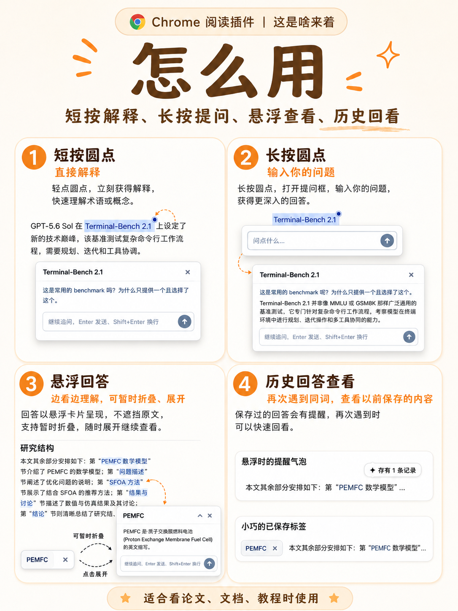
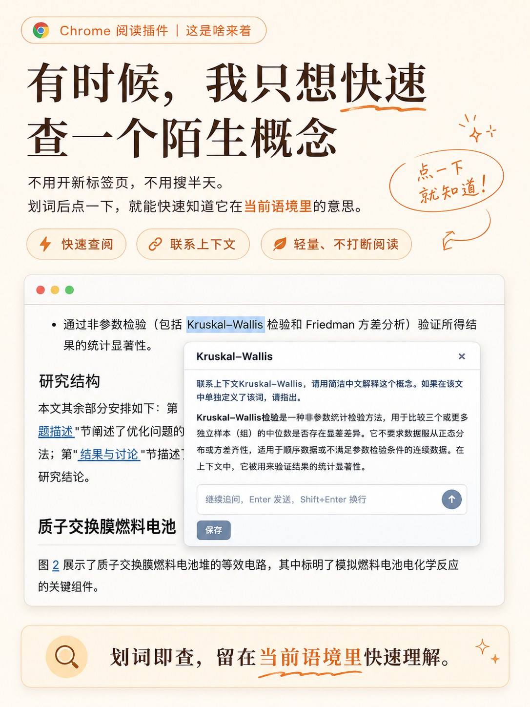
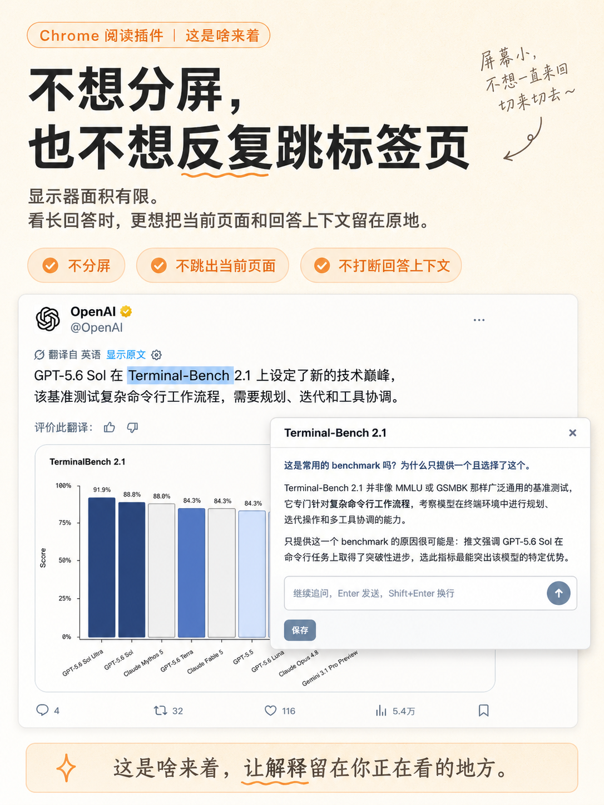

# 「这是啥来着」

[中文](README.md)

「这是啥来着」 is a Chrome Manifest V3 reading assistant. When you select an unfamiliar concept, acronym, or short phrase on a web page, it calls your configured AI model to produce a concise contextual explanation and lets you save useful answers as local reading memories.

The extension is designed to stay out of the way: explanations are temporary by default, history is only created when you save an answer, and saved terms show lightweight reminders instead of covering the page.

## Quick Start

### Install

This repository provides the source form of an unpacked extension:

1. Open `chrome://extensions`. If you use Vivaldi, you can also open `vivaldi://extensions`.
2. Turn on **Developer mode** in the upper-right corner.
3. Click **Load unpacked**. In Chinese browser UI, this may appear as **「加载已解包扩展」** or **「加载已解压的扩展程序」**.
4. Select the project root that contains `manifest.json`.
5. Open the 「这是啥来着」 settings page and configure provider, API Base URL, API Key, and model name.
6. Refresh the target page and start selecting text.

Browser internal pages, Chrome Web Store pages, and other extension pages cannot run content scripts because of Chrome security restrictions.

### Use

1. Select a word, acronym, or short phrase on a regular web page.
2. Click the small dot next to the selection to run the default prompt.
3. Long-press the dot to ask a custom question.
4. Continue with follow-ups, or save the full answer or an excerpt.
5. Later, hover matching saved terms to revisit previous explanations.

## Visual Overview

Click an image to open the full-size version.

<table>
  <tr>
    <td width="33%" valign="top">
      <a href="docs/assets/readme/how-to-use.png">
        
      </a>
      <br>
      <strong>Short press, long press</strong>
    </td>
    <td width="33%" valign="top">
      <a href="docs/assets/readme/quick-lookup.png">
        
      </a>
      <br>
      <strong>Stay in context</strong>
    </td>
    <td width="33%" valign="top">
      <a href="docs/assets/readme/keep-context.png">
        
      </a>
      <br>
      <strong>No split screen</strong>
    </td>
  </tr>
</table>

## Friendly Link

- [LINUX DO](https://linux.do) - a Chinese developer community. This project adds the friend link with reference to the [LINUX DO open-source promotion note](https://linux.do/t/topic/1776670).

## Current Version

- Extension version: `0.3.0`
- Manifest: Chrome Manifest V3
- Landing page: `docs/index.html`
- Storage: `chrome.storage.local`

## Core Features

- **Selected-text explanations**: select a word, acronym, or phrase and click the small dot near the selection.
- **Context awareness**: optionally send nearby page context to improve the explanation.
- **Custom questions**: long-press the dot to ask your own question.
- **Follow-ups**: continue asking about the same concept in the answer panel.
- **Explicit saving**: temporary answers are not saved until you click Save.
- **Excerpt saving**: select part of an answer and save only the useful excerpt.
- **History reminders**: revisit saved explanations through subtle reminders when the term appears again.
- **Multiple model providers**: supports common OpenAI-compatible services and local model servers.
- **Local-first storage**: no telemetry and no project-operated backend.

## Model Configuration

The settings page includes presets and supports custom OpenAI-compatible endpoints.

| Provider | Base URL Example | Notes |
| --- | --- | --- |
| DeepSeek | `https://api.deepseek.com/v1` | Default provider |
| Kimi | `https://api.moonshot.cn/v1` | Supports model list refresh |
| Volcengine Ark | `https://ark.cn-beijing.volces.com/api/v3` | Usually requires entering a model name manually |
| Zhipu GLM | `https://open.bigmodel.cn/api/paas/v4` | Supports OpenAI-compatible calls |
| OpenAI | `https://api.openai.com/v1` | Official model API |
| OpenRouter | `https://openrouter.ai/api/v1` | Routes across multiple model providers |
| Groq | `https://api.groq.com/openai/v1` | Fast inference models |
| Ollama | `http://localhost:11434/v1` | Local models; API Key can be empty |
| LM Studio | `http://localhost:1234/v1` | Local models; API Key can be empty |

Default prompts:

```text
联系上下文{{term}} ，请用简洁中文解释这个概念。如果在该文中单独定义了该词，则回答。
```

```text
Use the surrounding context around {{term}} to briefly explain this concept in English. If the article defines the term explicitly, use that definition.
```

The extension supports Chinese and English. Language defaults to browser language and can be changed manually in Settings. The default prompt follows the selected language automatically; `{{term}}` represents the selected text.

## Privacy and Data

「这是啥来着」 does not send data to project-operated servers and includes no telemetry.

When generating an explanation, the extension sends these items to your configured model endpoint:

- The selected word or phrase.
- The question you asked.
- Nearby selection context, only when the context option is enabled.

The following data stays in local browser storage:

- Model configuration and API Key.
- Default prompt, language, theme color, save scope, and reminder settings.
- Explanations, excerpts, follow-ups, and source-page metadata that you explicitly save.

When using third-party model services, follow their privacy policies and data terms.

## Permissions

`manifest.json` uses these permissions:

- `storage`: save settings and history explanations.
- `activeTab`: refresh current page state.
- `tabs`: open source pages and settings/history pages.
- `http://*/*`, `https://*/*`: inject the content script on regular web pages.

Toolbar icons are provided as `16`, `24`, `32`, `48`, and `128` pixel PNG files for browser scaling and display-density support.

## Local Development

The project has no build step. Load the source directory directly as an unpacked Chrome extension.

Run before committing:

```bash
npm run validate
```

The validation script checks the manifest, locale files, entry files, icon dimensions, and primary JavaScript syntax.

## Packaging

Create a zip package:

```bash
npm run package
```

The output is `dist/whats-this-again.zip`. Before submitting to the Chrome Web Store, add the store-required privacy policy, screenshots, category, and detailed listing copy.

## Known Limits

- History matching is text-based and does not merge terms semantically.
- Unsaved temporary answers do not survive page refreshes.
- The extension currently targets Chromium-based browsers; Firefox, Safari, and mobile browsers are not compatibility targets yet.
- Model quality, latency, and data handling depend on the model provider you configure.

## License

MIT License. See [LICENSE](LICENSE).
